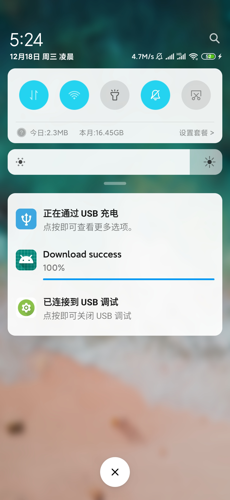

- 

- 

- 下载线程使用ASyncTask实现，即DownloadTask类。

- AsyncTask封装进了DownloadService类，DownloadService内部类DownloadBinder设置了启动asynctask的方法，`startDownload(String url)`,url即为下载链接。暂停下载，取消下载分别是binder的`pauseDownload``cancelDownload`方法，不需要参数。

- 只需要在UI线程完成connection的重写，使用bindService的方法启动服务。再通知binder的上述几个方法，启动，暂停，取消下载即可。

- 下载功能使用`okhttp`,支持`断点重传`，`显示进度`，`Notification跳转进界面`功能。

- `Activity`使用SDK的代码demo如下：

  ```java
      public static final String url = "要下载内容的网址";
  	//建立Binder
      public DownloadService.DownloadBinder downloadBinder;
  	//创建连接
      private ServiceConnection connection = new ServiceConnection() {
          @Override
          public void onServiceConnected(ComponentName name, IBinder service) {
              downloadBinder = (DownloadService.DownloadBinder)service;
          }
  
          @Override
          public void onServiceDisconnected(ComponentName name) {
  
          }
      };
  
  	//这里是请求写入内存的权限的方法，一并给出
  
      @Override
      public void onRequestPermissionsResult(int requestCode, @NonNull String[] permissions, @NonNull int[] grantResults) {
          switch(requestCode){
              case 1:
                  if(grantResults.length > 0 && grantResults[0] != PackageManager.PERMISSION_GRANTED){
                      Toast.makeText(this, "拒绝权限无法使用程序", Toast.LENGTH_SHORT).show();
                      finish();
                  }
                  break;
          }
      }
  
  		//绑定服务，检查写文件的权限
  		Intent intent = new Intent(this, DownloadService.class);
          startService(intent);
          bindService(intent, connection, BIND_AUTO_CREATE);
          if(ContextCompat.checkSelfPermission(MainActivity.this, Manifest.permission.WRITE_EXTERNAL_STORAGE) != PackageManager.PERMISSION_GRANTED){
              ActivityCompat.requestPermissions(MainActivity.this, new String[]{Manifest.permission.WRITE_EXTERNAL_STORAGE}, 1);
          }
  	//按钮调用方法实例
  	@Override
      public void onClick(View v) {
          if(downloadBinder == null){
              return;
          }
          switch(v.getId()){
              case R.id.start:
                  downloadBinder.startDownload(url);
                  break;
              case R.id.pause:
                  downloadBinder.pauseDownload();
                  break;
              case R.id.cancel:
                  downloadBinder.cancelDownload();
                  break;
          }
      }
  ```

  